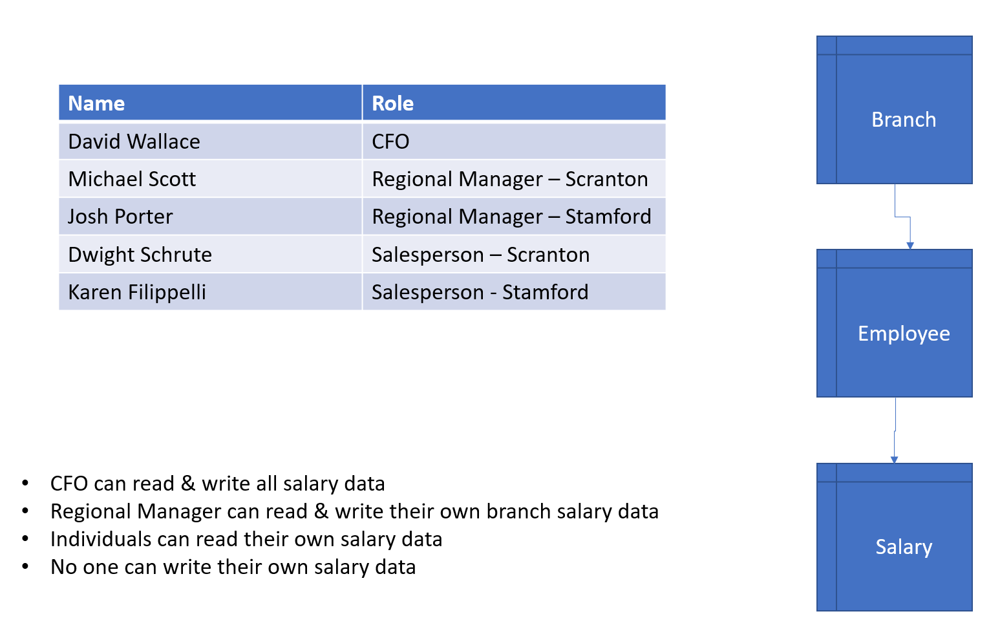
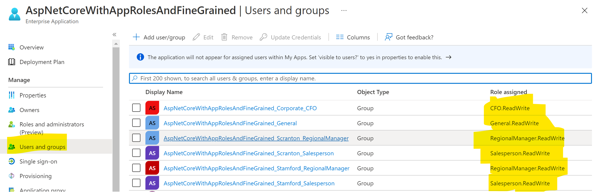
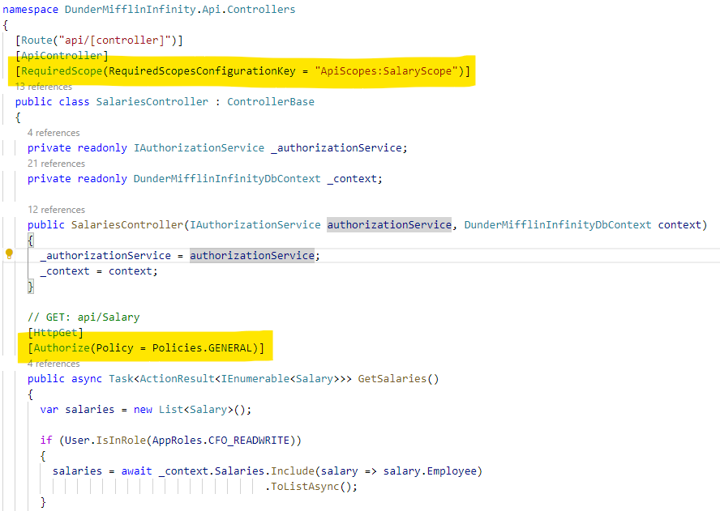
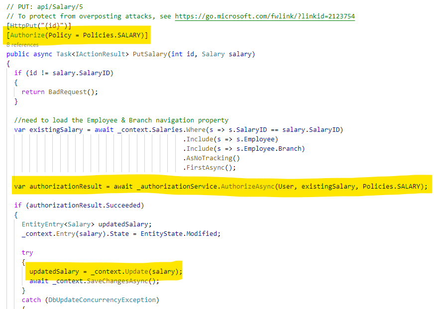

# AspNetCoreAppRolesFineGrainedApi

This demo use AAD App Roles & also provides fine-grained access control to data using [Resource-based](https://docs.microsoft.com/en-us/aspnet/core/security/authorization/resourcebased?view=aspnetcore-5.0) and [Policy-based](https://docs.microsoft.com/en-us/aspnet/core/security/authorization/policies?view=aspnetcore-5.0) authorization.

## Disclaimer

**THE SOFTWARE IS PROVIDED "AS IS", WITHOUT WARRANTY OF ANY KIND, EXPRESS OR IMPLIED, INCLUDING BUT NOT LIMITED TO THE WARRANTIES OF MERCHANTABILITY, FITNESS FOR A PARTICULAR PURPOSE AND NONINFRINGEMENT. IN NO EVENT SHALL THE AUTHORS OR COPYRIGHT HOLDERS BE LIABLE FOR ANY CLAIM, DAMAGES OR OTHER LIABILITY, WHETHER IN AN ACTION OF CONTRACT, TORT OR OTHERWISE, ARISING FROM, OUT OF OR IN CONNECTION WITH THE SOFTWARE OR THE USE OR OTHER DEALINGS IN THE SOFTWARE.**

## Rules

In this example, we want to provide fine-grained access control using Azure Active Directory App Roles & Groups. This way, we don't have to maintain the list of users and their roles in our application. Instead, we can keep our application focused on "role-based access".



In this example, there are 2 branches of the company & a corporate office. The following rules should apply:

- Each person should be to read their own salary data
- No person should be able to modify their own salary data
- The regional manager of a branch should be able to read & write all salary data for their branch only
- The CFO should be able to read & write all salary data for all employees (except themselves, of course)

## Azure Active Directory configuration for web API

To use this example, you will need to configure 2 Azure Active Directory App Registrations/Service Princpals & AAD groups. One for the backend API and one for the front-end web app.

### Create App Registration & configure

1.  Navigate to the Azure Active Directory blade in the [Azure portal](https://portal.azure.com)

1.  Click on the **App Registrations** blade

1.  Click **New registration**

1.  Assign a **Name**, **Accounts in this organizational directory only** & the **Redirect URI**

    > Note: You can assign this later if you don't know the redirect URI. If running locally, the default is **https://localhost:5001/signin-oidc**

1.  On the **Overview** blade, copy the following information to Notepad so you can use it later:

    - **Application (client) ID**
    - **Directory (tenant) ID**

1.  On the **Authentication** blade, select the **Implicit grant and hybrid flows->ID tokens** check box to enable ID tokens to be retrieved using OAuth2 **[hybrid flow](https://docs.microsoft.com/en-us/azure/active-directory/develop/v2-oauth2-auth-code-flow#request-an-id-token-as-well-hybrid-flow)**

1.  On the **Certificates & secrets** blade, click on **New client secret** and create a new secret. Store this secret in Notepad so you can use it later.

1.  On the **Token configuration** blade, add 2 new claims:

    **groups**
    1.  Click **Add groups claim**
    1.  Select **Groups assigned to the application**
    1.  Under **ID**, select **Group ID**
    1.  Click **Save**

    **upn**
    1.  Click **Add optional claim**
    1.  Select **Token type->ID**
    1.  Check the box for **upn**
    1.  Click **Add**

    )

1.  On the **API permissions** blade, make sure you have the following API permissions (click on **Add a permission** if not)

    **Microsoft Graph**
    - profile
    - User.Read

1.  On the **Expose an API** page, define 3 scopes for your API to expose. This allows you to provide different levels of access to different front-end applications that might want different levels of data (for instance, a sales app that shows sales data & a HR app that shows salary data)

    1. Click **Add a scope**
    1. **Scope name** : **Salary.ReadWrite**
    1. **Who can consent** : **Admins only**
    1. Fill out the other data as needed
    1. Click **Save**

    Repeat these steps and create a **Sales.ReadWrite** scope & a **Default.ReadWrite** scope. You should require admin consent for the **Sales.ReadWrite** scope, but you can leave the **Who can consent** flag set to **Admins and users** for the **Default.ReadWrite** scope.

1.  On the **App roles** blade, create 4 roles (click on **Create app role**).

    Display Name | Description | Allowed member types | Value
    ------------ | ----------- | -------------------- | -----
    General.ReadWrite | General users can read & write their own data | Users/Groups | General.ReadWrite
    Salesperson.ReadWrite | Salespeople can read & write their own data | Users/Groups | Salesperson.ReadWrite
    RegionalManager.ReadWrite | Regional Managers can read & write their own branch data | Users/Groups | RegionalManager.ReadWrite
    CFO.ReadWrite | CFO can read and write all data | Users/Groups | CFO.ReadWrite

1.  On the **Manifest** blade, make sure the **groupMembershipClaims** is set to **ApplicationGroup**

    

### Create AAD Groups

1.  On the **Groups** blade, create groups for each branch & role. Assign users as needed.

    Name | Group Type | Membership Type
    ---- | ---------- | ---------------
    WebAppName_General | Security | Assigned
    WebAppName_Scranton_Salespersion | Security | Assigned
    WebAppName_Scranton_RegionalManager | Security | Assigned
    WebAppName_Stamford_Salesperson | Security | Assigned
    WebAppName_Stamford_RegionalManager | Security | Assigned
    WebAppName_Corporate_CFO | Security | Assigned

### Configure Service Principal (Enterprise Application) to use AAD groups

1.  Under the **Enterprise applciations** blade, search for your new AAD service principal (the same name as the app registration)

1.  Under the **Users and groups** blade, click on **Add user/group** and map the new AAD groups to their respective roles.

    Display Name | Object Type | Role assigned
    ------------ | ----------- | -------------
    WebAppName_General | Group | General.ReadWrite
    WebAppName_Scranton_Salespersion | Group | Salesperson.ReadWrite
    WebAppName_Scranton_RegionalManager | Group | RegionalManager.ReadWrite
    WebAppName_Stamford_Salesperson | Group | Salesperson.ReadWrite
    WebAppName_Stamford_RegionalManager | Group | RegionalManager.ReadWrite
    WebAppName_Corporate_CFO | Group | CFO.ReadWrite

    

## Azure Active Directory configuration for web app

The steps for configuring the App Registration & Service Principal for the web app are similar to the ones for the web API. You will need to add API permissions to your Web API & consent for them.

1.  Under the **API permissions** blade, add permissions to your web API.

    1.  Click **Add a permission**
    1.  Select **My APIs**
    1.  Select the app registration API
    1.  Click **Delegated permissions**
    1.  Select **Default.ReadWrite** & **Salary.ReadWrite**
    1.  Click **Add permissions**
    1.  Click **Grant admin consent for <tenant-name>**

Becuase this is sensitive data (salaries, sales data, etc), we don't want to allow users to consent for themselves to expose this data to any app that might request them. Instead, we require **admin consent** so that we can control which apps get access to this data.


## Web API configuration

1.  In the `src/DunderMifflinInfinity.API/appsettings.json` file, update the **AzureAD** section with the AAD app registration values you copied to Notepad before.

1.  In the `src/DunderMifflinInfinity.API/Data/DbInitializer.cs` file, update the values to match your **app role names**, **group IDs** and **users**.

## Web app configuration

1.  In the `src/DunderMifflinInfinity.WebApp/appsettings.json` file, update the **AzureAD** section with the AAD app registration values you copied to Notepad before.

## Run locally

1.  Initialize the local Sqlite database. Make sure you are in the `src/DunderMifflinInfinity.API` directory.

    ```shell
    dotnet ef database update
    ```

1.  Run the API

    ```shell
    dotnet watch run
    ```

1.  Run the application (in a separate shell)

    ```shell
    dotnet watch run
    ```

As you sign in with different users, you will see that they have different permissions.

**Salesperson**

As someone with the General.ReadWrite role, Dwight can see his own salary, but not his fellow employees. He also cannot create a new salary record or modify his salary.


**Regional manager - Scranton**

As someone with the RegionalManager.ReadWrite role, Michael can see his own salary and the salaries of his branch employees (but not those of the Stamford branch). He can modify his own employees salaries, but not his own.


**Regional manager - Stamford**

As someone with the RegionalManager.ReadWrite role, Josh can see his own salary and the salaries of his branch employees (but not those of the Scranton branch). He can modify his own employees salaries, but not his own.


**CFO**

As someone with the CFO.ReadWrite role, David can see his own salary and the salaries of all his employees. He can modify his employees salaries, but not his own.


## How this works

### ID token for each user signin

We don't want to have to constantly issue Graph API queries to find out information about the user, so we can request that every JWT ID token that is presented to the application include the **AAD groups** they are a part of (that are related to the application), the **app roles** the user is assigned (by virtue of being in those AAD groups) and the **upn** of the user (so we can key off it in the database).


### Setup authorization service

In the `src/DunderMifflinInfinity.API/Startup.cs` file in the **ConfigureServices** method, we need to set up the authorization policies we want enforced.


- You can group several roles together into a single policy so that you don't have to specify them multiple times.
- You can define a list of requirements that must all return **Succeeded** for the policy to pass.

Add a new `SalaryAuthorizationHandler` to the list of services.

### Authorization Service

In the `src/DunderMifflinInfinity.API/AuthorizationHandlers/SalaryAuthorizationHandler.cs` file, the **SalaryAuthorizationHandler** service is responsible for evaluating the list of requirements defined in the **Salary** policy.

It will loop through each requirement as defined in the `Startup.cs` file. For each requirement, a function will get called to evaluate it.


For the **CannotModifyOwnSalaryRequirement**, we need to check the `User.Identity.Name` to see if it is the same `UserPrincipalName` of the **Salary** object the user is trying to modify. No one should be able to modify their own salary.


For the **OnlyManagementCanModifySalariesRequirement**, we need to check the roles the signed-in user has to see if they are in a management role.


For the **BranchManagerCanOnlyModifyOwnBranchSalariesRequirement**, we need to check if the user is a regional manager, and if so, ensure they are only modifying data for their own branch employees.


### API Controllers

**Index**

In the `src/DunderMifflinInfinity.API/Controllers/SalariesController.cs` file, in the **Index** method, we use the **Policies.General** because everyone can see **some** salary data, but it will change depending on their role. We use Entity Framework to only pull the appropriate data for each role.



**Edit**

In the `src/DunderMifflinInfinity.API/Controllers/SalariesController.cs` file, in the **Edit** method, we use the **_authorizationService** to evaluate if the signed-in user is allowed to modify the **Salary** object. If so, we make the database change, otherwise, we forbid it. This will call the **SalaryAuthorizationService** and loop through all requirements.



### Web App Controllers

The Web App controllers delegate accessing the web API to some helper Services (`src/DunderMifflinInfinity.WebApp/Services`) that get an access token when needed. 

```csharp
private async Task PrepareAuthenticatedClient()
{
  var accessToken = await tokenAcquisition.GetAccessTokenForUserAsync(new[] { scope });
  httpClient.DefaultRequestHeaders.Authorization = new AuthenticationHeaderValue("Bearer", accessToken);
  httpClient.DefaultRequestHeaders.Accept.Add(new MediaTypeWithQualityHeaderValue("application/json"));
}

private async Task<HttpResponseMessage> ExecuteApi(HttpMethod httpMethod, string apiEndpoint, StringContent? jsonContent = null)
{
  await PrepareAuthenticatedClient();
  HttpRequestMessage httpRequestMessage = new HttpRequestMessage(httpMethod, apiBaseAddress + apiEndpoint){
    Content = jsonContent
  };

  return await httpClient.SendAsync(httpRequestMessage);
}
```

These services are registered in the `src/DunderMifflinInfinity.WebApp/Startup.cs` file.

```csharp
services.AddHttpClient<IBranchApiService, BranchApiService>();
services.AddHttpClient<IEmployeeApiService, EmployeeApiService>();
services.AddHttpClient<ISalaryApiService, SalaryApiService>();
services.AddHttpClient<ISaleApiService, SaleApiService>();
```

### Views

In the `src/DunderMifflinInfinity.WebApp/Views/Salaries/Index.cshtml` you can see that we hide the **Create new** button if the user is not a manager.

We also hide the **Edit** and **Delete** buttons if the user is not a manager & is not trying to modify their own salary.


## Tests

Unit tests can be found in the `src/DunderMifflinInfinity.API.Tests` directory. Run with the following command in that directory.

```shell
dotnet test
```

## Deployment to Azure

Run the following command in an existing resource group.

```shell
cd inf/bicep
az deployment group create --resource-group rg-webAppWithAppRolesAndFineGrained-ussc-demo --template-file ./main.bicep --parameters ./main.parameters.json
```

## References

- https://docs.microsoft.com/en-us/azure/active-directory/develop/howto-add-app-roles-in-azure-ad-apps
- https://docs.microsoft.com/en-us/aspnet/core/security/authorization/resourcebased?view=aspnetcore-5.0
- https://docs.microsoft.com/en-us/aspnet/core/security/authorization/policies?view=aspnetcore-5.0
- https://docs.microsoft.com/en-us/ef/core/cli/dotnet#dotnet-ef-database-update
- https://docs.microsoft.com/en-us/ef/core/querying/related-data/explicit
- https://docs.microsoft.com/en-us/ef/core/change-tracking/explicit-tracking
